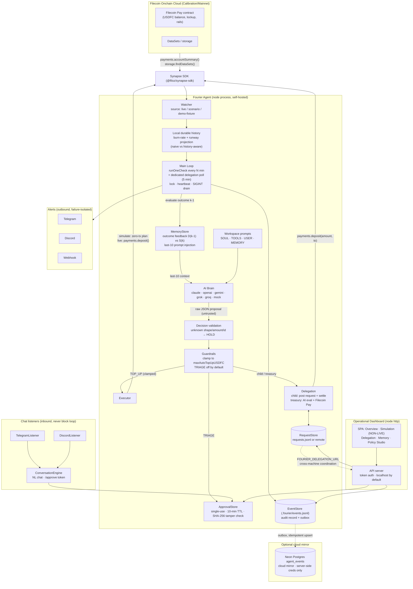

# Architecture

Fourier is a self-hosted, policy-constrained storage budget agent for Filecoin
Onchain Cloud. The AI proposes; deterministic TypeScript code validates,
clamps, gates, authorizes, executes, records, and reports.

## Decision pipeline (order is the safety model)

| # | Stage | Authority | Failure behavior |
|---|---|---|---|
| 1 | Observe (`watcher.ts`) | Synapse SDK read | Typed error, **no fabricated zeros** → no decision |
| 2 | Outcome feedback (`memory.ts`) | Deterministic | Offline-tolerant (local JSONL) |
| 3 | Propose (`brain.ts`) | **AI (untrusted)** | Provider error → HOLD with visible category |
| 4 | Validate (`decision-schema.ts`) | Deterministic | Any deviation → HOLD |
| 5 | Guardrails (`guardrails.ts`) | **Deterministic only** | Clamp / hold / require approval |
| 6 | Authorize (`approvals.ts`) | Deterministic | Unknown/expired/reused/tampered → reject |
| 7 | Execute (`executor.ts`, `delegation.ts`) | SDK | Honest `failed` status, no fabricated tx hash |
| 8 | Record (`store.ts`, `memory.ts`) | Local-first | Outbox retries; loop never blocks |
| 9 | Notify (`notifications/`) | Best-effort | Bounded retries, never crash loop |

Invariants enforced in code and covered by tests (`packages/agent/test/`):
malformed output → HOLD; top-up clamped to policy max; TRIAGE disabled by
default and approval-gated; simulation never constructs a signer or dispatches
a transaction; model/notification/store failures never stop the loop; secrets
never enter logs, events, the dashboard, or Git.

## Data ownership (self-hosted default)

| Store | Location | Content |
|---|---|---|
| Audit log | `.fourier/events.jsonl` | Full decision records + outbox state |
| Agent memory | `.fourier/memory.jsonl` | Decisions + evaluated outcomes |
| Delegation queue | `.fourier/requests.jsonl` or remote API | Child↔treasury funding requests |
| Approvals | `.fourier/approvals.json` | Single-use tokens + proposal hashes |
| Runtime | `.fourier/agent.lock`, `heartbeat.json` | Process lock, liveness |
| Config | `fourier.config.json` (gitignored) | Policy/thresholds — **no secrets** |
| Secrets | `.env` (gitignored) | Keys only; never in config or dashboard |

The Neon mirror (`core/sync.ts`) is opt-in via `FOURIER_DATABASE_URL` and only
ever *copies* data outward with idempotent upserts: the event outbox, memory
outcomes, delegation-request statuses, the policy snapshot, and the hashed
access code. The agent never reads decisions back from it.
